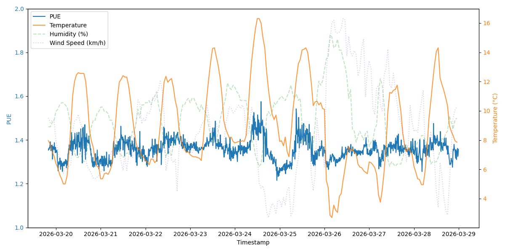

# 04 - LLM Inference & Energy Cost Analysis

This folder contains the software used to run a stress test on a vLLM deployment, measure the statistics of each API call (e.g., token count), and correlate those stats with the GPU nodes telemetry on Kubernetes. Combined with the datacenter PUE (Power Usage Effectiveness), this provides a comprehensive analysis of inference costs. 

The raw data used to produce these results is available on [Zenodo](https://zenodo.org/records/19468082).

---

## Contents

* **`00-locust-benchmark/`**: Contains the tools to run the LLM benchmark using `locust`. This includes a jobfile, a Python configuration file, example prompts, and a script to generate new prompts.
* **`results/`**: The raw output logs generated from running the benchmark.
* **`data-analysis/`**: Notebooks and data files used to analyze the benchmark results and calculate the energy consumption per token.

---

## 📊 Experiment Results & Energy Cost

| Model | Active GPUs | Tokens/s | Avg Active GPU Usage (%) | Active GPU Energy/1k Tokens (Wh) | Inactive GPU Energy/1k Tokens (Wh) | CPU Energy/1k Tokens (Wh) | System Energy/1k Tokens (Wh) | Adjusted Total Energy/1k Tokens (Wh) |
| :--- | :--- | :--- | :--- | :--- | :--- | :--- | :--- | :--- |
| **GPT-OSS-120B** | 2 | 1472.89 | 100.00 | 0.184221 | 0.079782 | 0.087312 | 0.583327 | 0.813479 |
| **GPT-OSS-120B** | 4 | 1499.49 | 97.98 | 0.263904 | 0.052214 | 0.088605 | 0.628604 | 0.888272 |
| **GPT-OSS-120B** | 8 | 1481.05 | 94.73 | 0.424468 | 0.000000 | 0.094377 | 0.778964 | 1.073710 |
| **Llama-4-Scout-17B** | 2 | 919.70 | 93.92 | 0.266333 | 0.127509 | 0.138900 | 0.890037 | 1.209338 |
| **Llama-4-Scout-17B** | 4 | 1033.64 | 89.80 | 0.368535 | 0.076342 | 0.127596 | 0.898197 | 1.230921 |
| **Llama-4-Scout-17B** | 8 | 960.91 | 74.18 | 0.640722 | 0.000000 | 0.143613 | 1.184249 | 1.626908 |
| **Qwen3-VL-235B-Thinking** | 4 | 791.68 | 94.56 | 0.566535 | 0.098931 | 0.165556 | 1.282124 | 1.733394 |
| **Qwen3-VL-235B-Thinking** | 8 | 955.68 | 88.00 | 0.757894 | 0.000000 | 0.144318 | 1.303959 | 1.791862 |

---

## ⚡ Datacenter PUE

The following chart illustrates the Power Usage Effectiveness (PUE) correlated with weather conditions during the benchmarking period.

---